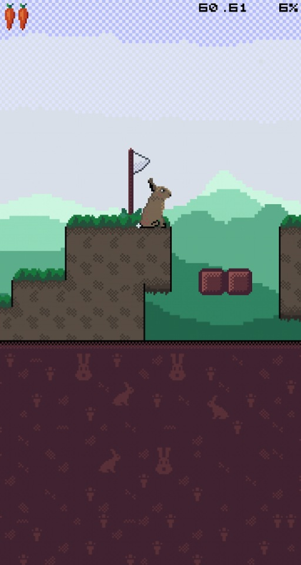

# JumpHare
An SDL2 OpenGL game written in C, also working on Web and Android.
Based on [some](https://github.com/renehorstmann/some) framework.

## Art
Pixelart was made with my [Pixelc](https://github.com/renehorstmann/pixelc) App.

Tile maps are designed with [Tilec](https://github.com/renehorstmann/tilec).

Both Apps are also based on [some](https://github.com/renehorstmann/some) framework.

## Live demo
Compiled with emscripten: [livedemo](https://renehorstmann.github.io)

Runs really well on touch screens.

On Desktop, use arrow keys to move, space to jump and enter to press a button.

Doesn't run on Apple, because... Apple... (poor WebGL2 support)

## Warning
In active developmemt

## Status


## Todo
- redraw background with levelheight/2=256 (instead of 128)
- hare double jump animation
- draw tiles
- goal?
- non final sound effects?
- enemies


## Compiling for Web
Using Emscripten:
```
emcc -I../include/ -s USE_SDL=2 -s USE_SDL_IMAGE=2 -s -s FULL_ES3=1 -s SDL2_IMAGE_FORMATS='["png"]' --preload-file ../res -s ALLOW_MEMORY_GROWTH=1 -DUSING_GLES ../src/e/*.c ../src/p/*.c ../src/r/*.c ../src/u/*.c ../src/*.c -o index.html
```

## Compiling on Windows
Compiling with Mingw (msys2).
Currently not working with cmake, but with the following gcc call.
I had to put all source files into one dir (from src/e/*, r/*, p/*, u/* into src/*) to get the linker happy.
```
gcc -o some src/* -Iinclude $(sdl2-config --cflags --libs) -lSDL2_image -lglew32 -lopengl32 -lglu32 -DUSING_GLEW
```

## Author
René Horstmann

## Licence
- The game and its assets are licenced under GPLv3, see LICENCE.
- The [some](https://github.com/renehorstmann/some) framework is under MIT licence, see someLICENCE.
